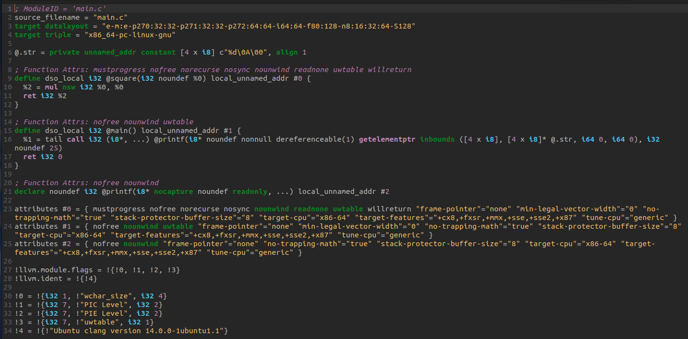
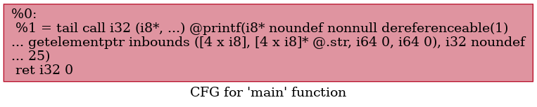
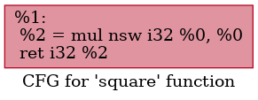
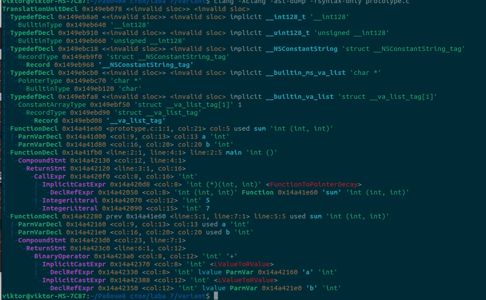
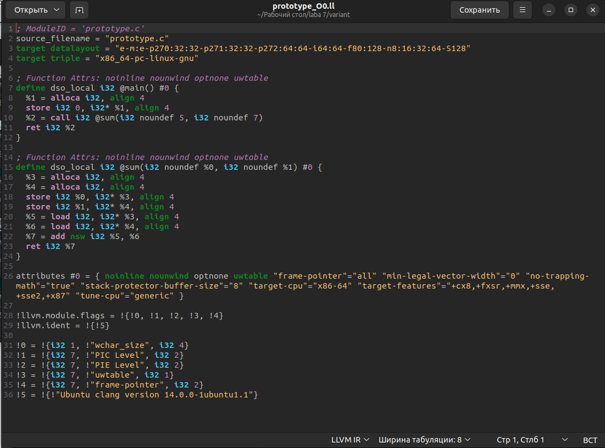
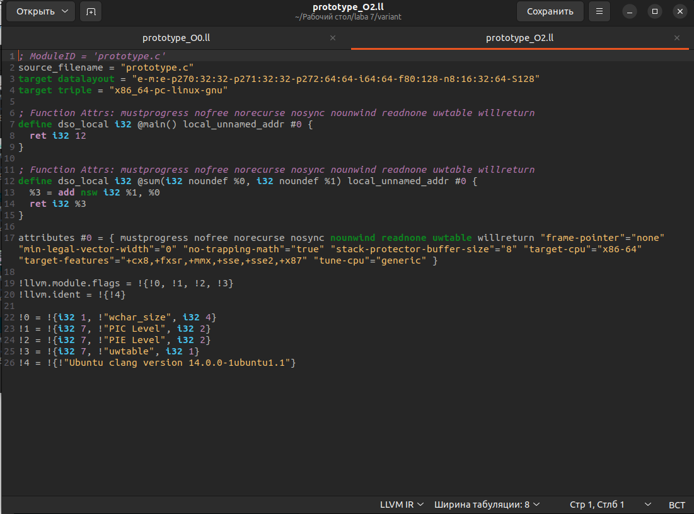
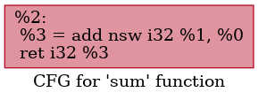
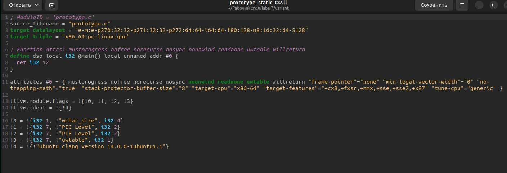

# 1. Название и цель лабораторной работы
**Название:** Лабораторная работа 7. Анализ и преобразование кода с использованием Clang и LLVM  
**Цель работы:** Цель работы
Познакомиться с инструментарием Clang и LLVM, освоить получение абстрактного синтаксического дерева (AST) и промежуточного представления (LLVM IR) для кода на C/C++, научиться применять базовые оптимизации, строить графы потока управления (CFG), а также анализировать влияние оптимизаций на различные синтаксические конструкции языка.  

# 2. Сведения об авторе
* **Студент:** Попов Виктор Андреевич
* **Группа:** АВТ-314
* **Учебное заведение:** НГТУ

# 3. Постановка задачи  
Необходимо выполнить следующие шаги:  
* Установка среды  
Установить Clang, LLVM, opt и Graphviz (например, в Ubuntu 26.04).

* Работа с AST  
Сгенерировать абстрактное синтаксическое дерево для заданного C/C++‑файла.

* Генерация LLVM IR  
Получить промежуточное представление кода без оптимизаций (-O0) и с оптимизациями (-O2).

* Оптимизация IR  
Применить оптимизации с помощью opt и/или флагов Clang, сравнить изменения.

* Построение CFG  
Построить граф потока управления для одной или нескольких функций.

* Индивидуальное задание (по варианту)  
Выполнить анализ конкретной синтаксической конструкции в соответствии с вариантом. Сформулировать, как LLVM обрабатывает выбранную конструкцию, какие оптимизации применяются.

* Выводы  
Ответить на контрольные вопросы

# 4. Индивидуальное задание
Пример кода:  
```c
int sum(int a, int b); // прототип  
int main() {  
return sum(5, 7);  
}  
int sum(int a, int b) {  
return a + b;  
}  
```  
Задания:  
1. Постройте AST. Укажите, виден ли на нем прототип.
2. Получите IR без оптимизаций.
3. Примените -O2. Произошло ли встраивание sum?
4. Постройте CFG для main и sum.
5. Исследуйте, что изменится при добавлении static к sum.
6. Сделайте выводы о роли прототипа в оптимизациях.  

# 5. Выполнение общего задания  
## 5.1 Работа с AST  
При синтаксическом анализе файла main.c с помощью утилиты Clang было получено абстрактное синтаксическое дерево.  
  

## 5.2 Генерация LLVM IR  
В неоптимизированном промежуточном представлении (-O0) код дословно транслирует логику исходного текста. Все локальные переменные размещаются в памяти на стеке при помощи инструкций alloca, а перед вычислениями перемещаются в виртуальные регистры командами load.  
  

## 5.3 Оптимизация IR  
При использовании флага -O2 оптимизатор LLVM применил проходы Inlining (встраивание тела функции) и Constant Folding (свертка констант). Компилятор вычислил значение константного выражения (получив 25), удалил работу со стеком и уничтожил вызов функции square из контекста main.  
  

## 5.4 Графы потока управления (CFG) 
  

  

# 6. Выполнение индивидуального задания  
## 6.1 Анализ синтаксического дерева прототипа функции  
В абстрактном синтаксическом дереве функция sum встречается дважды. Первое вхождение (FunctionDecl без дочернего узла CompoundStmt) является представлением прототипа. Это необходимо семантическому анализатору для строгой проверки типов передаваемых аргументов при генерации узла CallExpr внутри main.  
 

## 6.2 LLVM без оптимизаций (-O0)  
На этапе трансляции в LLVM IR прототипы функций отбрасываются. Промежуточное представление оперирует исключительно определениями (define) или внешними ссылками (declare). Поскольку реализация sum находится в текущем модуле трансляции, прототип исчезает как избыточная синтаксическая конструкция.  
 

## 6.3 LLVM c оптимизацией (-O2)  
При компиляции с оптимизацией вызов sum(5, 7) был встроен в main, а константы свернуты (результат вычисления — 12).
 

## 6.4 Графы потока управления (CFG)  
  

  

## 6.5 Добавление static 
Добавление static к прототипу и функции изменило связывание (linkage) на internal. Поскольку все вызовы sum были успешно встроены (inlined) в main, оригинальная функция стала недостижимой. В результате проход Dead Code Elimination (удаление мертвого кода) полностью удалил определение @sum из итогового IR-кода, сэкономив память.  
 

## 6.6 Выводы
Синтаксическая конструкция "Прототип функции" является исключительно инструментом компилятораClang. Она служит "контрактом" для обеспечения типобезопасности языка C/C++ и живет только в виде узлов AST. На этапе LLVM IR понятие прототипа стирается. Само по себе наличие или отсутствие предварительного объявления никак не влияет на качество и глубину последующих оптимизаций. 

# 7. Ответы на контрольные вопросы 

1. Что такое Clang, и какова его роль в процессе компиляции программ?  
Clang - это фронтенд компилятора для языков C, C++ и Objective-C. Его роль - анализ исходного кода (лексический, синтаксический, семантический),
построение AST и генерация LLVM IR, который затем передается в
оптимизатор и бэкенд LLVM.  
2. Что представляет собой LLVM и как он используется в современных компиляторах?  
LLVM - это инфраструктура для построения компиляторов, основанная на
едином промежуточном представлении (IR). Используется в Clang, Rustc,
Swift и других компиляторах. Состоит из фронтенда, middle-end
(оптимизатор) и бэкенда (генерация машинного кода).  
3. Чем отличается абстрактное синтаксическое дерево (AST) от
промежуточного представления LLVM IR?  
AST - высокоуровневое представление, близкое к исходному языку (циклы,
условные операторы, типы языка). LLVM IR - низкоуровневое
представление, похожее на ассемблер с типами, в SSA-форме. AST удобен
для анализа синтаксиса, IR - для оптимизаций.  
4. Для чего необходимо промежуточное представление (IR) в процессе
компиляции?  
IR - единый язык между фронтендом и бэкендом. Он позволяет:
Использовать одни и те же оптимизации для разных языков
Добавлять новые языки без переписывания бэкенда
Добавлять новые архитектуры без изменения фронтенда  
5. Что делает инструкция alloca в LLVM IR, и зачем она используется в
функциях?  
alloca выделяет память на стеке для переменной. Используется в -O0, так как
упрощает отладку (каждая переменная имеет адрес в памяти). В
оптимизированном коде alloca обычно заменяется на SSA-регистры.  
6. Зачем нужна оптимизация кода в компиляторе, и какие основные
цели она преследует?  
Оптимизация улучшает программу без изменения ее поведения. Основные
цели:
Ускорение выполнения (скорость)
Уменьшение размера кода
Снижение энергопотребления
Улучшение использования кэша  
7. Что такое SSA-форма и почему она важна при оптимизации
программ?  
SSA (Static Single Assignment) - форма, где каждая переменная получает
значение ровно один раз. Это упрощает анализ потока данных, позволяет
легко находить константы, удалять мертвый код и выполнять другие
оптимизации.  
8. Что такое граф потока управления (CFG) и как он помогает
анализировать поведение программы?  
CFG - граф, где узлы - базовые блоки (линейные участки кода), а ребра -
переходы между ними. Помогает:
Находить циклы
Обнаруживать недостижимый код
Оптимизировать переходы
Выполнять глобальный анализ программы  
9. Как устроено представление арифметических операций в LLVM IR
(например, умножение, сложение)?  
Арифметические операции имеют вид: %result = add i32 %a, %b или %result =
mul i32 %x, %y. Все операции типизированы (i32, i64, float, double).
Поддерживаются флаги: nsw (No Signed Wrap), nuw (No Unsigned Wrap).  
10. Почему функции в LLVM IR обычно представляют собой отдельные
единицы анализа и оптимизации?  
LLVM анализирует и оптимизирует код внутри функций (intra-procedural),
потому что:
Структура управления локальна для функции
Анализ легче и быстрее
Можно параллельно оптимизировать разные функции
Межпроцедурные оптимизации выполняются отдельно  
11. Что происходит с функцией в LLVM IR, если она вызывается один
раз и очень короткая?  
LLVM встроит (inlined) функцию - заменит вызов на ее тело. Это устраняет
накладные расходы на вызов и открывает возможности для дальнейших
оптимизаций (распространение констант, свертка и т.д.).  
12. Какие преимущества даёт использование IR и CFG для
автоматических оптимизаций по сравнению с анализом исходного
текста на C?  
IR уже содержит информацию о типах, потоках данных и управления
IR в SSA-форме упрощает анализ
CFG наглядно показывает структуру программы
IR не зависит от исходного языка
Можно применять одни и те же оптимизации к коду на любом языке
Проще автоматически анализировать и преобразовывать
