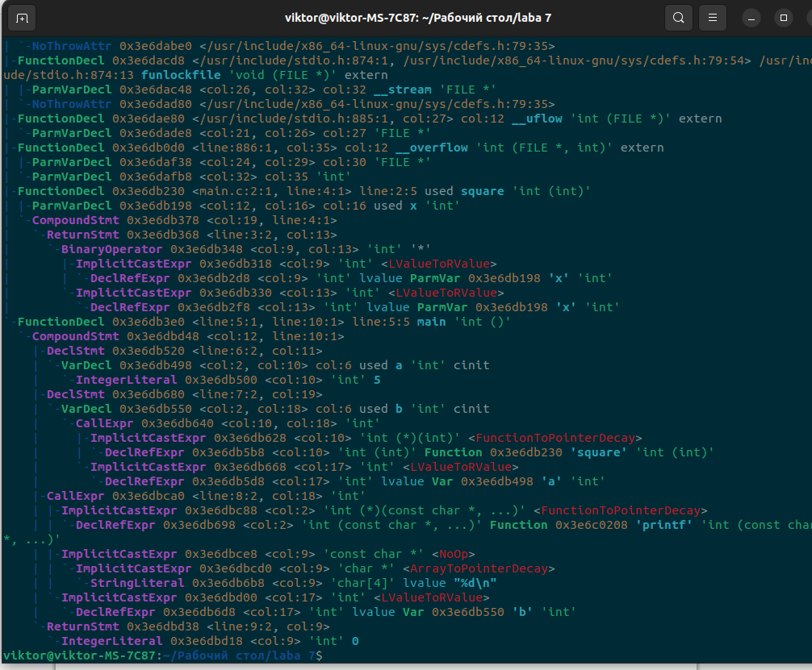
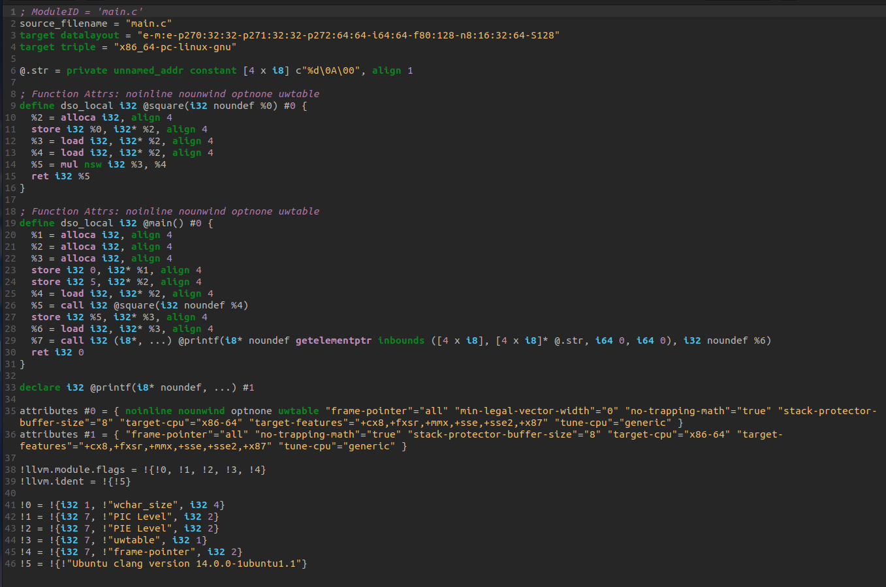

# 1. Название и цель лабораторной работы
**Название:** Лабораторная работа 7. Анализ и преобразование кода с использованием Clang и LLVM  
**Цель работы:** Цель работы
Познакомиться с инструментарием Clang и LLVM, освоить получение абстрактного синтаксического дерева (AST) и промежуточного представления (LLVM IR) для кода на C/C++, научиться применять базовые оптимизации, строить графы потока управления (CFG), а также анализировать влияние оптимизаций на различные синтаксические конструкции языка.  

# 2. Сведения об авторе
* **Студент:** Попов Виктор Андреевич
* **Группа:** АВТ-314
* **Учебное заведение:** НГТУ

# 3. Постановка задачи  
Необходимо выполнить следующие шаги:  
* Установка среды  
Установить Clang, LLVM, opt и Graphviz (например, в Ubuntu 26.04).

* Работа с AST  
Сгенерировать абстрактное синтаксическое дерево для заданного C/C++‑файла.

* Генерация LLVM IR  
Получить промежуточное представление кода без оптимизаций (-O0) и с оптимизациями (-O2).

* Оптимизация IR  
Применить оптимизации с помощью opt и/или флагов Clang, сравнить изменения.

* Построение CFG  
Построить граф потока управления для одной или нескольких функций.

* Индивидуальное задание (по варианту)  
Выполнить анализ конкретной синтаксической конструкции в соответствии с вариантом. Сформулировать, как LLVM обрабатывает выбранную конструкцию, какие оптимизации применяются.

* Выводы  
Ответить на контрольные вопросы

# 4. Индивидуальное задание
Пример кода:  
```c
int sum(int a, int b); // прототип  
int main() {  
return sum(5, 7);  
}  
int sum(int a, int b) {  
return a + b;  
}  
```  
Задания:  
1. Постройте AST. Укажите, виден ли на нем прототип.
2. Получите IR без оптимизаций.
3. Примените -O2. Произошло ли встраивание sum?
4. Постройте CFG для main и sum.
5. Исследуйте, что изменится при добавлении static к sum.
6. Сделайте выводы о роли прототипа в оптимизациях.  

# 5. Выполнение общего задания  
## 5.1 Работа с AST  
  


## 5.2 Генерация LLVM IR  
  


